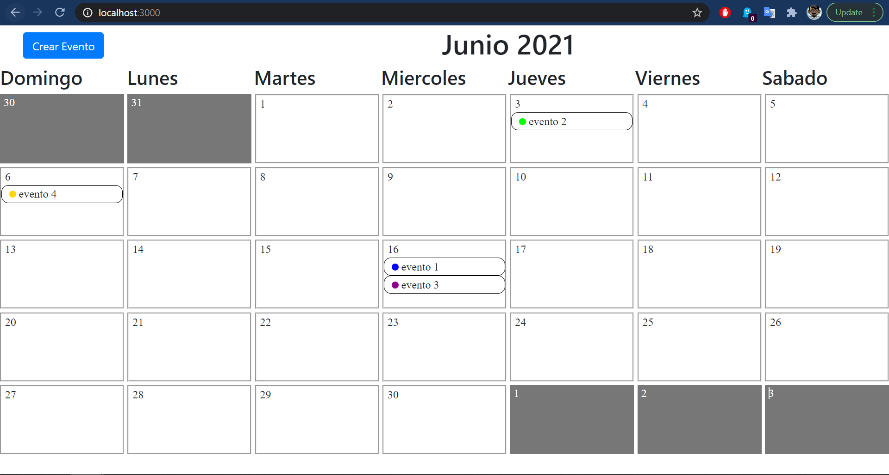

# prueba-tecnica-slabcode
Esta es una prueba tecnica

Pasos para la instalacion

1) instalar el script de base de datos en la carpeta backend/database/slabcodedb.sql y desplegar el servicio
2) modificar los parametros de conexion de la api en backend/node-app/.env.development (en caso de ejecutar en localhost no se necesitan cambiar)
3) instalar las librerias de la api en backend/node-app/ usar npm install y desplegar npm start
4) instalar las librerias de la web app en frontend/calendar-app/ usar npm install y desplegar npm start

